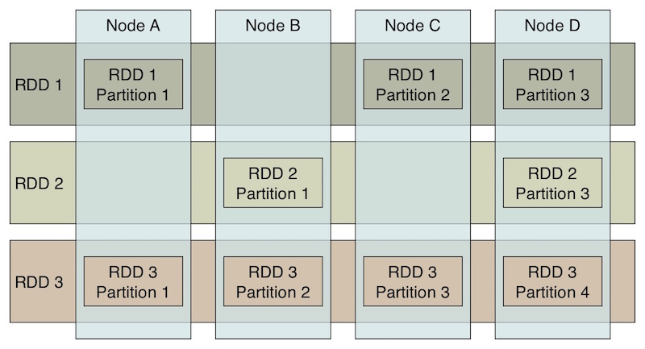

## DataStax Enterprise Workshop - Integration of Cassandra and Apache Spark

    

Ryan Knight
[DataStax](http://datastax.com)
[@knight_cloud](https://twitter.com/knight_cloud)

Exercises and material based on material written by Dean Wampler, Steve Lowenthal and others - see Attributions below.

This workshop demonstrates how to write and run [Apache Spark](http://spark.apache.org) version 1.2 applications that connect into Cassandra. They where designed to be run with the Spark embedded in [DataStax Enterprise](http://docs.datastax.com/en/datastax_enterprise/4.7/datastax_enterprise/spark/sparkIntro.html).  DataStax Enterprise uses the [Spark Cassandra Connector](https://github.com/datastax/spark-cassandra-connector) to integrate Spark and Cassandra.  DataStax Enterprise provides high availability of the Spark Master. You can run the examples and exercises locally on your workstation connecting into a local DataStax Enterprise or on a server running on a separate machine.

## Setup Instructions

The workshop requires the following software:
* Java 8
* Install [Maven](https://maven.apache.org/download.cgi)
* Install DataStax Enterprise 4.7

### Install & configure DSE

* Download the latest [DataStax Enterprise 4.6 Release](www.datastax.com/downloads)
  * There are a number of different install options inculding a virtual machine or plain tarball install.
  * A tarball can be downloaded from the [Enterprise Downloads](http://downloads.datastax.com/enterprise/)
* Create a single node cluster either on your local laptop, a virtual machine or a cloud server.
  * A tarball install is as simple as unzipping it and running DSE.
* As a minimum set the following parameters in Cassandra.yaml to your IP address:
  * Listener address: 127.0.0.1
  * RPC address: 127.0.0.1
* Ensure that user that runs DSE has write permissions to the following directories.  (These are the default directories used by a tarball install, a GUI install uses different directories):
  * Cassandra data files /var/lib/cassandra
  * Spark data file location to /var/lib/spark
  * Set the log file locations with correct write permissions:
  * Cassandra log files /var/log/cassandra
  * Spark log files /var/log/spark
* Running DSE from a terminal window with Spark enabled (tarball install):
  * cd to the dse directory (i.e. cd ~/dse-4.7.0)
  * run DSE with Spark Enabled:  bin/dse cassandra -k
* Running DSE with Spark from a package install [see these docs](http://docs.datastax.com/en/datastax_enterprise/4.6/datastax_enterprise/spark/sparkStart.html)
* Verify cqlsh is running.  In a separate terminal window:
  * cd to the dse directory (i.e. cd ~/dse-4.7.0)
  * run cqlsh:   bin/cqlsh localhost
* Verify the Spark Master is up by going to [url of the spark master](http://localhost:7080/)

## Intro to Spark

This workshop demonstrates how to write and run [Apache Spark](http://spark.apache.org) version 1.1 applications that use the Spark Cassandra Connector to read and write data to Cassandra.

## Introduction: What Is Spark?

Let's start with an overview of Spark, then discuss how to setup and use this workshop.

[Apache Spark](http://spark.apache.org) is a distributed computing system written in Scala for distributed data programming.

Spark includes support for event stream processing, as well as more traditional batch-mode applications. There is a [SparkSQL](http://spark.apache.org/docs/latest/sql-programming-guide.html) module for working with data sets through SQL queries. It integrates the core Spark API with embedded SQL queries with defined schemas. It also offers [Hive](http://hive.apache.org) integration so you can query existing Hive tables, even create and delete them. Finally, it has JSON support, where records written in JSON can be parsed automatically with the schema inferred and RDDs can be written as JSON.

There is also an interactive shell, which is an enhanced version of the Scala REPL (read, eval, print loop shell). SparkSQL adds a SQL-only REPL shell. For completeness, you can also use a custom Python shell that exposes Spark's Python API. A Java API is also supported and R support is under development.

## Why Spark?

By 2013, it became increasingly clear that a successor was needed for the venerable [Hadoop MapReduce](http://wiki.apache.org/hadoop/MapReduce) compute engine. MapReduce applications are difficult to write, but more importantly, MapReduce has significant performance limitations and it can't support event-streaming ("real-time") scenarios.

Spark was seen as the best, general-purpose alternative, so all the major Hadoop vendors announced support for it in their distributions.

## Spark Clusters

Let's briefly discuss the anatomy of a Spark cluster, adapting [this discussion (and diagram) from the Spark documentation](http://spark.apache.org/docs/latest/cluster-overview.html). Consider the following diagram:

Each program we'll write is a *Driver Program*. It uses a [SparkContext](http://spark.apache.org/docs/latest/api/scala/index.html#org.apache.spark.SparkContext) to communicate with the *Cluster Manager*, which is an abstraction over [Hadoop YARN](http://hortonworks.com/hadoop/yarn/), local mode, standalone (static cluster) mode, Mesos, and EC2.

The *Cluster Manager* allocates resources. An *Executor* JVM process is created on each worker node per client application. It manages local resources, such as the cache (see below) and it runs tasks, which are provided by your program in the form of Java jar files or Python scripts.

Because each application has its own executor process per node, applications can't share data through the *Spark Context*. External storage has to be used (e.g., the file system, a database, a message queue, etc.)

## Resilient, Distributed Datasets

The data caching is one of the key reasons that Spark's performance is considerably better than the performance of MapReduce. Spark stores the data for the job in *Resilient, Distributed Datasets* (RDDs), where a logical data set is virtualized over the cluster.

The user can specify that data in an RDD should be cached in memory for subsequent reuse. In contrast, MapReduce has no such mechanism, so a complex job requiring a sequence of MapReduce jobs will be penalized by a complete flush to disk of intermediate data, followed by a subsequent reloading into memory by the next job.

RDDs support common data operations, such as *map*, *flatmap*, *filter*, *fold/reduce*, and *groupby*. RDDs are resilient in the sense that if a "partition" of data is lost on one node, it can be reconstructed from the original source without having to start the whole job over again.

The architecture of RDDs is described in the research paper [Resilient Distributed Datasets: A Fault-Tolerant Abstraction for In-Memory Cluster Computing](https://www.usenix.org/system/files/conference/nsdi12/nsdi12-final138.pdf).

## SparkSQL

[SparkSQL](http://spark.apache.org/docs/latest/sql-programming-guide.html) adds the ability to specify schema for RDDs, run SQL queries on them, and even create, delete, and query tables in [Hive](http://hive.apache.org), the original SQL tool for Hadoop. Recently, support was added for parsing JSON records, inferring their schema, and writing RDDs in JSON format.

Several years ago, the Spark team ported the Hive query engine to Spark, calling it [Shark](http://shark.cs.berkeley.edu/). That port is now deprecated. SparkSQL will replace it once it is feature compatible with Hive. The new query planner is called [Catalyst](http://databricks.com/blog/2014/03/26/spark-sql-manipulating-structured-data-using-spark-2.html).

## The Spark Version

This workshop uses Spark 1.2.1.

The following documentation links provide more information about Spark:

* [Documentation](http://spark.apache.org/docs/latest/).
* [Javadocs API](http://spark.apache.org/docs/latest/api/java/index.html).

The [Documentation](http://spark.apache.org/docs/latest/) includes a getting-started guide and overviews. You'll find the [Javadocs API](http://spark.apache.org/docs/latest/api/java/index.html) useful for the workshop.

## Next Steps

* [Intro to CQL and Cassandra Data Modeling](introCql/README.md)
* [Intro to Spark with Java 8 Lambdas](sparkStarter/README.md)
* [Intro to Spark and Cassandra](introSparkCassandra/README.md)

## Attributions

These exercises were originally written by Dean Wampler, Ph.D

[Spark Workshop](https://github.com/deanwampler/spark-workshop)
[Typesafe](http://typesafe.com)
[dean.wampler@typesafe.com](mailto:dean.wampler@typesafe.com)
[@deanwampler](https://twitter.com/deanwampler)

The Cassandra Retail demo was copied from Steve Lownethal
[Retail Demo](https://github.com/slowenthal/retail)
